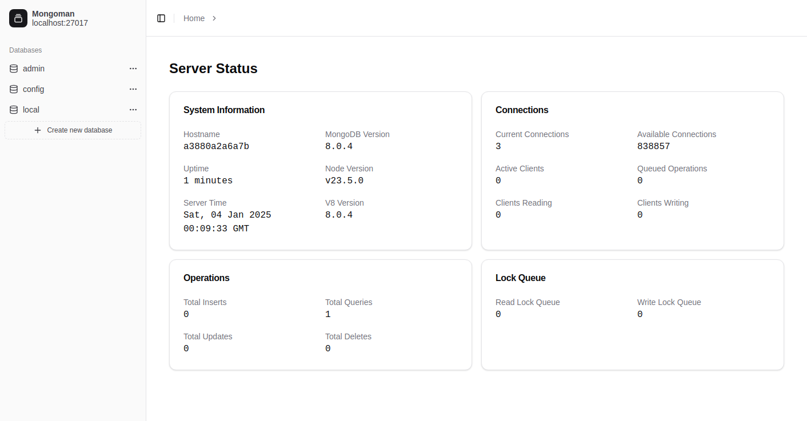
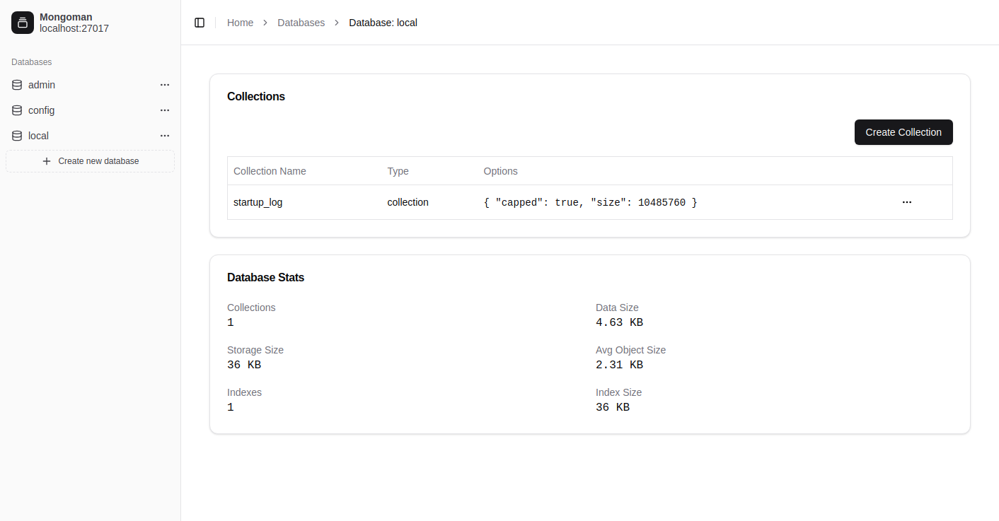

# MongoMan Documentation

A modern, web-based MongoDB admin interface built with Next.js, shadcn/ui, and Tailwind CSS. MongoMan provides an intuitive way to manage your MongoDB databases, collections, and documents with a clean and responsive UI.



{: .warning }
> This project is currently under active development. Some features may be missing or partially implemented. Bug reports, feature requests, and contributions are warmly welcomed! Please feel free to open issues or submit pull requests.

{: .note }
> The initial version of MongoMan is primarily developed through conversations with Anthropic's Claude AI (3.5 Sonnet), with minimal manual coding from my side, just quick code reviews and partial improvements. While this essentially shows the potential of "AI-assisted" development, I am now actively maintaining and improving the codebase myself as the project scope has grown.

## Key Features



- 🎨 Modern UI built with shadcn/ui and Tailwind CSS
- 📊 Database statistics and monitoring
- 📝 Collection management
- 📄 Document management

## Quick Start

1. Install using Docker:
```bash
docker run -p 3000:3000 -e MONGODB_URI=mongodb://mongo:27017 ghcr.io/aientech/mongoman:main
```

2. Or install locally:
```bash
git clone git@github.com:AienTech/mongoman.git
cd mongoman
yarn install
cp .env.example .env.local
yarn dev
```

## Tech Stack

- Next.js 15
- React
- TypeScript
- shadcn/ui
- Tailwind CSS
- TanStack Table
- MongoDB Node.js Driver

[Get Started with Installation](){: .btn .btn-primary .fs-5 .mb-4 .mb-md-0 .mr-2 }